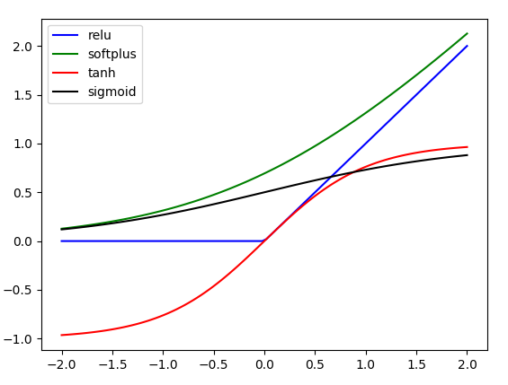

###  内容
* 目录
    * Activations.py            激活函数
    * SimpleRegression.py       简单线性回归
    * SimpleClassification.py   简单分类
    * AutoEnCoder.py            自编码

###  激活函数
#### 1.一些激活函数及其特征
* tf.nn.relu    负数置0，保留正数  
* tf.nn.softplus 将x映射到0-x之间  
* tf.nn.tanh     将值映射到-1和1之间  
* sigmoid        将值映射到0-1之间

#### 2.资料
>激活函数是用来加入非线性因素的，因为线性模型的表达能力不够。   
>对于线性不可分的数据，需要找到合适的线性方程，有以下方法：
* 做线性变换(linear transformation)，比如讲x,y变成x^2,y^2。
* 引入非线性函数。  
    * 例如：激活函数我们选择阀值函数（threshold function），也就是大于某个值输出1（被激活了），小于等于则输出0（没有激活）。这个函数是非线性函数。
#### 3.准确率和召回率
>在信息检索领域，精确率和召回率又被称为查准率和查全率  
>查准率＝检索出的相关信息量 / 检索出的信息总量  
>查全率＝检索出的相关信息量 / 系统中的相关信息总量

>例子：假设我们手上有60个正样本，40个负样本，系统查找出50个正样本  
>其中只有40个是真正的正样本，计算上述指标。
* TP: 将正类预测为正类数  40
* FN: 将正类预测为负类数  20
* FP: 将负类预测为正类数  10
* TN: 将负类预测为负类数  30
>准确率(accuracy) = 预测对的/所有 = (TP+TN)/(TP+FN+FP+TN) = 70%  
>精确率(precision) = TP/(TP+FP) = 80%  
>召回率(recall) = TP/(TP+FN) = 2/3  
>准确率就是“你的预测有多少是对的”  
>召回率就是“正例里你的预测覆盖了多少”  
>此外，还有ROC曲线，PR曲线，AUC等评价指标.

