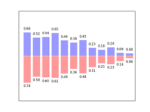
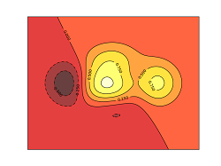
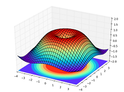
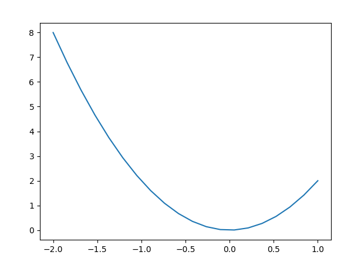
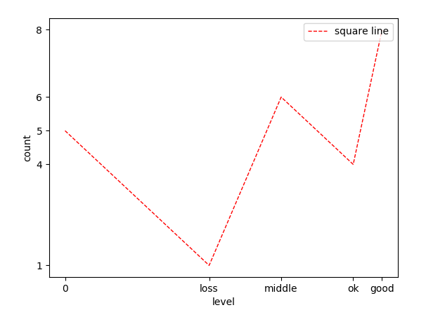

# matplotlib简介
## 简介
>
Matplotlib 是一个非常强大的 Python 画图工具  
使用Matplotlib用以将你的数据可视化  
它能画出美丽的: 
 * 线图;  
 * 散点图;  
 * 等高线图;  
 * 条形图;  
 * 柱状图;    
 * 3D 图形,   
 * 甚至是图形动画等等.  
>

## 安装
>
<pre><code>
# python 3+
sudo apt-get install python3-matplotlib
# python 2+
sudo apt-get install python-matplotlib
</code></pre>
>
## matplotlib用法
##### 1.创建图像窗口
<pre><code>
plt.figure()    # 定义图像窗口 
plt.plot(x, y)  # 画曲线
plt.show()      # 显示窗口
</code></pre>
##### 例子
<pre><code>
import matplotlib.pyplot as plt
import numpy as np
x = np.linspace(-2, 1, 20)
y = 2*x**2
plt.figure()
plt.plot(x, y)
plt.show()
</code></pre>
##### 效果

##### 2.调节参数
>指定窗口(figure)编号3,尺寸8*5  
>画出两条线段,其中y2指定颜色red,线宽1.0,风格为虚线
>num,color,linewidth,linestyle,label
<pre><code>
plt.figure(num=3, figsize=(8, 5),)
plt.plot(x, y1)
plt.plot(x, y2, color='red', linewidth=1.0, linestyle='--', label='xxx')
plt.show()
</code></pre>
##### 3.设置坐标轴
>xlim,ylim,xlabel,ylabel  
>xticks,yticks,label,legend
>不支持中文
<pre><code>
# label设置曲线名字
plt.plot(x,y,label='XXX')
# xlim,ylim设置坐标范围
plt.xlim((-1, 2))
plt.ylim((-2, 3))
# xlabel,ylabel设置坐标轴名称
plt.xlabel('X轴名称')
plt.ylabel('Y轴名称')
# xticks,yticks设置刻度,及刻度点名称
x_ticks = np.linspace(-1, 2, 5)
plt.xticks(x_ticks)
plt.yticks([-2, -1.8, -1, 1.22, 3],
           [r'$really\ bad$', r'$bad$', r'$normal$', r'$good$', r'$really\ good$'])
plt.plot(x, y, color='red', linewidth=1.0, linestyle='--', label='square line')
# legend设置图例位置,图例又plt.plot中的label指定
plt.legend(loc='upper right')
plt.show()
</code></pre>
##### 例子
<pre><code>
import matplotlib.pyplot as plt
import numpy as np
plt.xlabel('level')
plt.ylabel('count')
x = np.array([0, 1, 1.5, 2, 2.2])
y = np.array([5, 1, 6, 4, 8])
plt.xticks(x, ['0', 'loss', 'middle', 'ok', 'good'])
plt.yticks(y)
plt.plot(x, y, color='red', linewidth=1.0, linestyle='--', label='square line')
plt.legend(loc='upper right')
plt.show()
</code></pre>
##### 效果

##### 4.坐标轴位置调整

##### 5.Subplot 多合一显示

##### 6.Subplot 分格显示

##### 7.Animation 动画

##### 8.图中图
> 略
##### 9.Annotation 标注
> 略
##### 10.tick 能见度
> 略
##### 11.次坐标轴

##### 12.Scatter 散点图

##### 13.Bar柱状图

##### 14.Contours 等高线图

##### 15.Image 图片

##### 16.3D 数据

