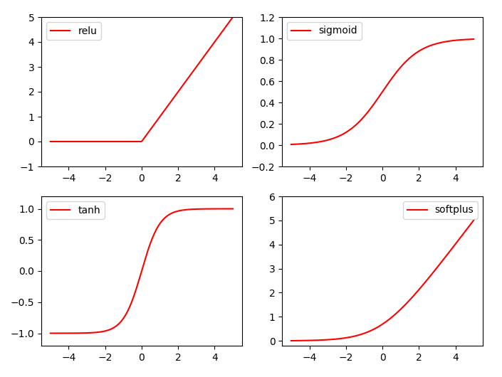

# tensorflow笔记

#### 1.API
>tf.equal
>tf.reduce_min,tf.reduce_max,tf.reduce_mean
<pre><code>
A = [[1,3,4,5,6]]  
B = [[1,3,4,3,2]]  
tf.equal(A, B)       # 比较两个张量元素相等的情况
# [[ True  True  True False False]]
tf.reduce_max()      # 求最大值
tf.reduce_mean(x)    # 2.5 如果不指定第二个参数，那么就在所有的元素中取平均值
tf.reduce_mean(x, 0) # [2.,  3.]   指定第二个参数为0，则第一维的元素取平均值，即每一列求平均值
tf.reduce_mean(x, 1) # [1.5,  3.5] 指定第二个参数为1，则第二维的元素取平均值，即每一行求平均值
</code></pre>
>tf.reset_default_graph
<pre><code>
# 清除网络
tf.reset_default_graph()
</code></pre>
#### 2.激励函数
>relu,sigmoid,tanh,softplus

#### 
