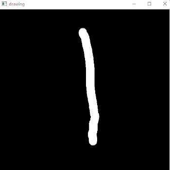
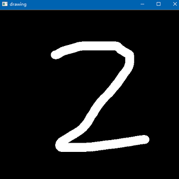

### 手写数字识别

#### 1.说明

* 项目基于tensorflow官网的卷积神经网络做了一些调优 
    * 添加函数，将训练数据和预测数据做了预处理，包括位置和大小的调整
    * 添加了dropout做了调整防止过拟合
    * 添加了手写板功能，可以自己手写检验
    * 输出预测的数字同时，输出预测超过一定概率的数字
* 对mnist提供的数据做两次训练识别率可以稳定在 1.0  

* 项目问题  
    * 由于数据集中的数据已经做了很好的规范和标注，使用自己手写的数字识别率略低于预测
    * mnist数据集符合西方书写风格
* 解决方案
    * 提供自定义数据集
    * 优化神经网络参数
    * 添加辅助算法，在预测中对超过一定概率的一组数字进行辅助判断

#### 2.识别效果

>按下左键书写，按下右键打印结果  

